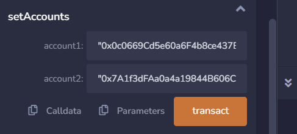
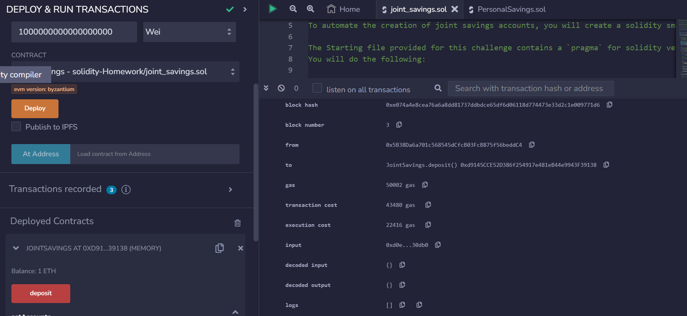
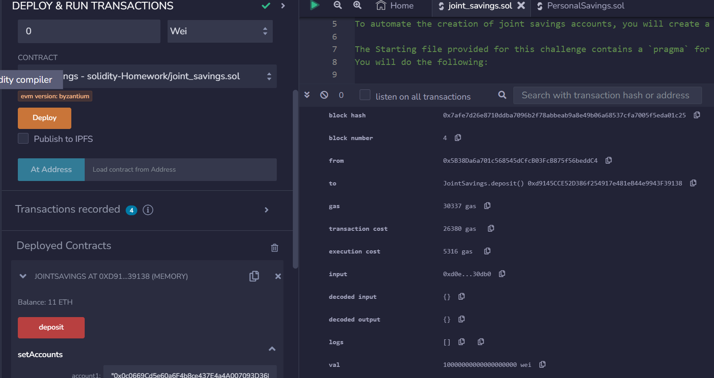
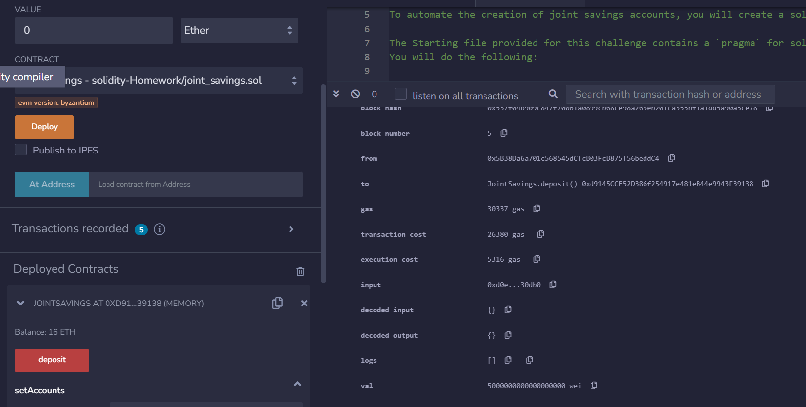
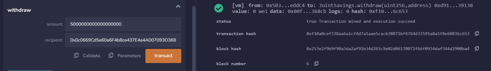
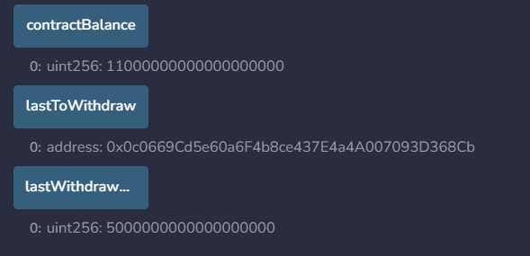
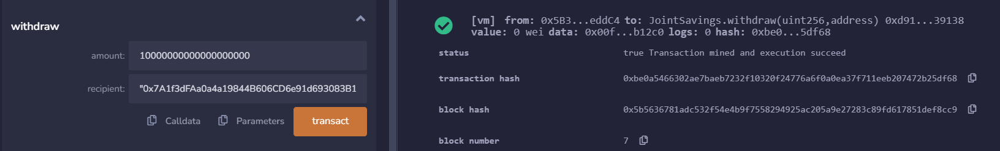
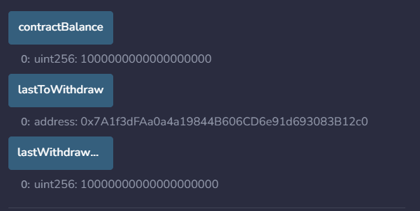

# Homework_module20

## 1. Joint Savings Account in Solidity
- Upload and open `joint_savings.sol` in Remix.
- Create:
  - Contract: `JointSavings`.
  - Variables: `accountOne`, `accountTwo`, `lastToWithdraw`, `lastWithdrawAmount`, `contractBalance`.
  - Functions: `withdraw`, `deposit`, `setAccounts`.
  - Fallback function.

## 2. Compile & Deploy

## 3. Interact with Contract
- Set accounts:
  - 
- Test deposits:
  - 1 ether in wei 
  - 10 ether in wei 
  - 5 ether 
- Test withdrawals:
  - 5 ether to accountOne.
    
    
  - 10 ether to accountTwo.
    
    
